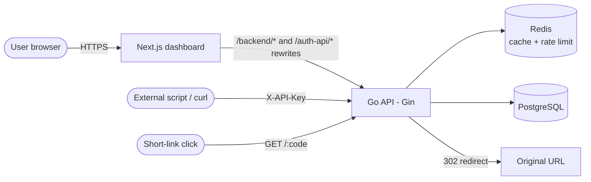
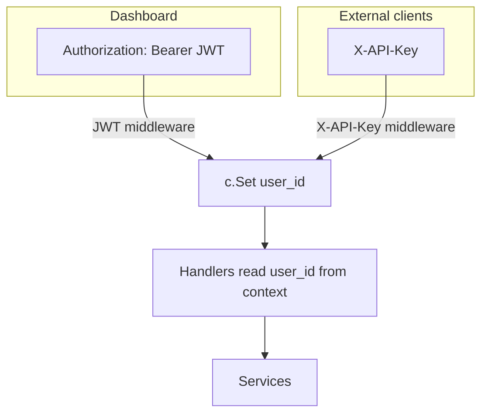
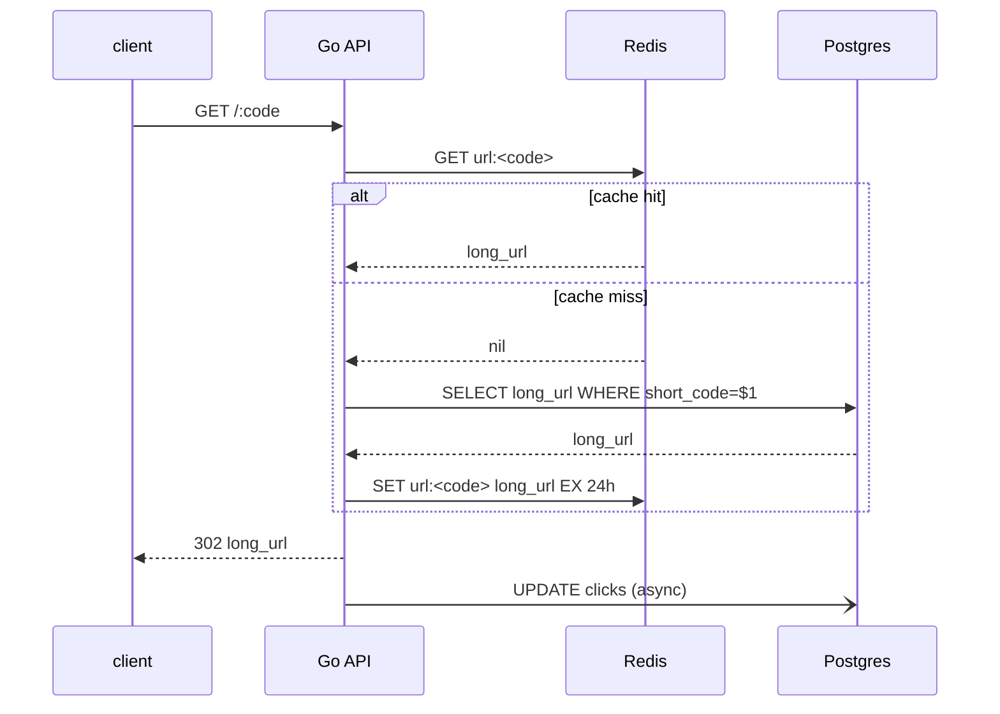

# Architecture

## Request flow



The **dashboard** never calls the API directly — it goes through the Next.js
proxy at `/backend/*` (X-API-Key routes) and `/auth-api/*` (JWT routes). This
keeps CORS out of the picture entirely.

## Two auth doors, one set of handlers



Both middlewares set the same `user_id` in the Gin context. Every handler
reads it with `c.GetString("user_id")`. This means:

- The dashboard authenticates with a short-lived JWT
- External integrations use long-lived API keys
- **No handler is ever mounted without one of these middlewares** — there is no
  route that can leak data without a user context

## Multi-tenant data isolation

Both `links` and `api_keys` carry `user_id`:

```sql
CREATE TABLE api_keys (
  id        TEXT PRIMARY KEY,
  user_id   TEXT REFERENCES users(id) ON DELETE CASCADE,
  key       TEXT UNIQUE NOT NULL,
  ...
);

CREATE TABLE links (
  id        TEXT PRIMARY KEY,
  user_id   TEXT REFERENCES users(id) ON DELETE CASCADE,
  short_code TEXT UNIQUE NOT NULL,
  ...
);
```

Every list/read/update/delete in the repository layer takes a `userID`
parameter and includes it in the `WHERE` clause. There is no "list all links"
method on the production API surface — only `ListLinksForUser(userID, …)`.

## ID generation — ticket server + scrambled base62

Sequential IDs are predictable and let people enumerate other users' short
codes. Random IDs collide. Slugify uses a **ticket server** strategy:

1. On boot, four ranges of 10 M IDs are seeded into a `ranges` table:
   `[1M..11M)`, `[11M..21M)`, `[21M..31M)`, `[31M..41M)`.
2. To mint an ID, the API:
   - picks a random active range
   - locks the row (`SELECT … FOR UPDATE`)
   - increments `current_id`
   - commits the transaction
3. The integer is encoded with a **scrambled base62 alphabet** (look at
   `api/internal/idgen/base62.go`). Two consecutive IDs produce
   non-adjacent-looking short codes.

Trade-offs:
- ✅ Globally unique with no coordination service
- ✅ Concurrent mints across pods are safe via row-level locks
- ✅ No collisions ever
- ⚠️ A burst within one range serializes on that row's lock; spread is via
  the random range selection
- ⚠️ When all ranges exhaust, you have to seed more

## Caching strategy



If Redis is down, every read falls through to Postgres — slower, but the system
keeps serving redirects.

## Rate limiting (token bucket in Redis)

Per API key:

- Bucket starts at 100 tokens
- Refill at 1 token per second, max 100
- Each request consumes 1 token
- 0 tokens → 429

State is stored under `rate_limit:<api_key_id>` in Redis. JWT routes are
intentionally not rate-limited (interactive dashboard usage).

## Schema (current migrations)

```
000001  create_links_table
000002  create_ranges_table
000003  create_api_keys_table
000004  add_is_active_to_links
000005  add_clicks_to_links
000006  create_users_table
000007  add_user_id_to_api_keys
000008  add_user_id_to_links
```

Every migration has an `.up.sql` and `.down.sql`. They're applied automatically
on API boot via `golang-migrate`.

## Layering

```
handlers/   ← HTTP only. Reads context, calls services.
services/   ← Business logic. NEVER imports gin or net/http.
db/         ← Repositories. Implements interfaces defined here.
models/     ← Plain types. No methods, no logic.
auth/       ← JWT + API-key crypto helpers.
idgen/      ← Base62 + ticket server.
middleware/ ← Request-scoped concerns (auth, rate limit, logging).
```

This separation is what makes the unit tests easy: services take repository
**interfaces**, so tests pass in fakes without touching Postgres.